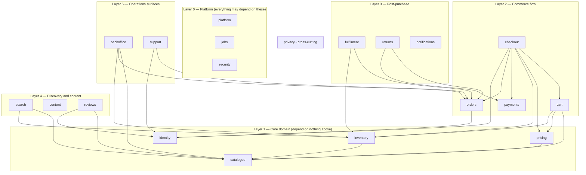

# Module decomposition

Divides the 134 requirements in [REQUIREMENTS.md](REQUIREMENTS.md) into **20 modules**, with
boundaries, dependency rules, build order, and where each lands in the repository.

Every requirement is allocated to exactly one owning module. Nothing is unassigned and
nothing is owned twice — a requirement with two owners has none.

---

## The architectural decision this rests on

**Build a modular monolith. One deployable per surface, hard module boundaries inside.**

Doc B describes an operation that at scale runs as separate services — §5's per-surface
SLOs, §7 R6's queues, §8's per-store backup policies all read that way. It is tempting to
start there. Do not.

| | Modular monolith | Microservices |
|---|---|---|
| Deployables | 2 (storefront API, back office) | ~20 |
| Local dev | `npm run dev` | Orchestration before you write a line |
| A cross-module change | One PR, one deploy, one transaction | Coordinated release across services |
| Doc B §3 "revertible in under 10 minutes" | Trivially true | Needs per-service rollback and version compatibility |
| Doc B §8 restore drill | One database | Per-service restore, plus consistency between them |
| Team required | 1+ | A platform team before any feature work |

Furniro has one person and an empty `Backend/index.js`. Microservices would spend the entire
budget on infrastructure and deliver no requirements.

**The boundaries below are real either way.** Modules own their data, expose an explicit
interface, and never reach into each other's internals. That is what makes extraction
possible later — if `payments` or `search` genuinely needs its own deployable at Stage 4, a
clean module lifts out. A monolith with tangled internals cannot be split at any price, and
that is the failure this document exists to prevent.

---

## Boundary rules

Five rules. They are the whole value of the decomposition; without enforcement this is just
a folder listing.

1. **A module owns its tables. No other module reads or writes them.** Cross-module data is
   fetched through the owner's interface. This is the rule that makes Doc B §8's per-store
   backup policy and §9's archiving possible.
2. **Import only through the module's public interface** — `modules/<name>/index.js`. Deep
   imports into another module's `repository.js` are the boundary breaking. Enforce it with
   ESLint `no-restricted-imports`, not with discipline.
3. **Dependencies point one way, and there are no cycles.** The layers below define the
   direction. If two modules need each other, either the boundary is wrong or an event
   belongs between them.
4. **Cross-module side effects go through events, not direct calls.** `orders` does not call
   `notifications`; it emits `order.placed` and `notifications` subscribes. This is what lets
   Doc B §7 R10 pause email without touching checkout.
5. **`checkout` is the only orchestrator.** Exactly one module coordinates others. More than
   one and the call graph becomes a mesh.

---

## Layers and dependency direction



**`payments` depends on no domain module, and nothing depends on it except `checkout` and
`returns`.** That isolation is deliberate: it is the PCI scope boundary (`PAY-12`), the
module most likely to be replaced when the provider changes, and the one whose failure must
not cascade. `orders` learns about payment outcomes through events, not by calling
`payments` — which is what makes Doc B §7 R3's "reconcile authorisations without orders, and
orders without authorisations" a meaningful reconciliation rather than a contradiction.

`notifications` appears in no arrow. Nothing calls it; it subscribes to events. That is
correct and deliberate.

---

## The modules

Size is relative build effort, not a schedule: **S** small, **M** medium, **L** large,
**XL** very large. Owner per Doc B §1. Runbooks per Doc B §7.

### Layer 0 — Platform

| Module | Owns | Requirements | Size | Owner | Runbook |
|---|---|---|---|---|---|
| `platform` | Config, health endpoint, feature flags, structured logging, correlation IDs, error tracking, CDN/cache policy, status page | `PLAT-01`–`04`, `PLAT-08`–`10` (7) | M | Platform engineer | R4 |
| `jobs` | Queue, workers, retries, dead-letter queue, scheduled jobs, backfill runner with kill switch | `PLAT-05`–`07` (3) | M | Platform engineer | R6 |
| `security` | Secret access, security headers, rate limiting, WAF/bot rules, dependency and secret scanning | `SEC-01`–`06` (6) | M | Security owner | R11, R12 |

`platform` is the first thing built and the thing every other module assumes. `PLAT-02`
(correlation IDs) in particular must exist before there is anything to debug — retrofitting
tracing across 20 modules is far more expensive than starting with it.

### Layer 1 — Core domain

| Module | Owns | Requirements | Size | Owner | Runbook |
|---|---|---|---|---|---|
| `catalogue` | Products, variants, categories, media, publish gate, SEO fields | `CAT-01`–`10` (10) | L | Catalogue manager | — |
| `identity` | Accounts, authentication, sessions, addresses, account lifecycle | `ACC-01`–`05` (5) | M | Engineering lead | — |
| `inventory` | ATP, reservations, movement ledger, buffers, SKU freeze | `INV-01`–`06` (6) | L | Engineering lead | R8 |
| `pricing` | Price resolution, promotions, discounts, coupons, tax class, display rules | `PROMO-01`–`05` (5) | L | Merchandising | — |

**`catalogue` is built across both tiers** — `Backend/src/modules/catalogue/` serves it,
`Frontend/src/modules/catalogue/` fetches it, and product data exists in exactly one file.
The remaining `CAT-*` work is variants, the publish gate and the ERP/PIM feed. The other
three modules in this layer are unstarted.

**`inventory` is separated from `catalogue` deliberately.** They look like one thing and are
not: catalogue data is read-heavy, cacheable and edited by humans; stock is write-heavy,
transactional, and `INV-02` requires every write to pass through the reservation path. Doc B
§9 also flags stock movements as a high-churn table needing its own vacuum and archiving
policy. Merging them guarantees the oversell in R8.

**`pricing` is separated from `catalogue`** because price rules change orders of magnitude
more often than product data, and because `CHK-06` requires one authoritative server-side
calculator. Two price calculators is how a storefront charges the wrong amount.

### Layer 2 — Commerce flow

| Module | Owns | Requirements | Size | Owner | Runbook |
|---|---|---|---|---|---|
| `cart` | Cart lines, cart persistence, abandonment lifecycle | `CART-01`–`05` (5) | M | Engineering lead | — |
| `checkout` | Checkout orchestration and step instrumentation. **Owns no durable domain data** | `CHK-01`–`08` (8) | L | Engineering lead | R1, R2 |
| `payments` | Gateway adapters, authorise/capture, idempotency keys, webhooks, tokens, reconciliation | `PAY-01`–`14` (14) | XL | Finance systems owner | R3, R11 |
| `orders` | Order state machine, line snapshots, order event log, archiving | `ORD-01`–`08` (8) | XL | Engineering lead | R1 |

`checkout` owning no durable data is the point — it is a saga across cart, inventory,
pricing, payments and orders. Give it its own tables and it becomes a second, competing
source of truth for orders.

`payments` and `orders` are the two XL modules and between them hold 22 of the 134
requirements. They are also where a mistake costs money rather than time.

### Layer 3 — Post-purchase

| Module | Owns | Requirements | Size | Owner | Runbook |
|---|---|---|---|---|---|
| `fulfilment` | Carrier adapters, rates, labels, tracking ingestion, manifests, manual fallback | `FUL-01`–`05` (5) | L | Operations lead | R9 |
| `returns` | Return requests, refund authorisation and limits, RTO reporting | `RET-01`–`05` (5) | M | Finance systems owner | — |
| `notifications` | Templates, transactional send, provider failover, deliverability, suppression | `NOTIF-01`–`05` (5) | M | Marketing ops | R10 |

`returns` depends on both `orders` and `payments`, and `RET-03` ("refunds blocked while
payment state is uncertain") is a rule it enforces by asking `payments`, never by assuming.

### Layer 4 — Discovery and content

| Module | Owns | Requirements | Size | Owner | Runbook |
|---|---|---|---|---|---|
| `search` | Index pipeline, alias swap, query API, synonyms, zero-result logging, fallback | `SRCH-01`–`07` (7) | L | Engineering lead | R7 |
| `content` | CMS pages, blog, legal pages, redirects, SEO health | `CONT-01`–`04` (4) | M | Content | — |
| `reviews` | Review submission, moderation queue, rejection reasons | `REV-01`–`02` (2) | S | Merchandising | — |

`search` is a **read-model over `catalogue` and `inventory`** — it owns its index, never
their tables. `SRCH-06`'s graceful degradation is only possible because of that: if the
index dies, category browse still works.

### Layer 5 — Operations surfaces

| Module | Owns | Requirements | Size | Owner | Runbook |
|---|---|---|---|---|---|
| `backoffice` | Admin UI, RBAC, MFA, access review, audit log, feature-flag console | `ADM-01`–`05` (5) | L | Engineering lead | — |
| `support` | Ticketing, order lookup, Tier 2 corrective tooling, export limits | `SUP-01`–`04` (4) | M | Support lead | — |

Doc B §10 is explicit that breaches arrive through admin surfaces and support tools, not
checkout. `ADM-04` (write-once audit log) and `SUP-04` (no bulk PII export by default) are
the two requirements most likely to be skipped and most likely to matter.

### Cross-cutting

| Module | Owns | Requirements | Size | Owner | Runbook |
|---|---|---|---|---|---|
| `privacy` | Subject-request intake, consent state, retention policy registry, deletion orchestration | `PRIV-01`–`08` (8) | L | Data protection owner | R12 |

`privacy` is the one module that legitimately reaches across every boundary — `PRIV-03`
anonymisation must touch every module holding personal data. It does so through a contract:
**every module owning personal data implements `anonymise(subjectId)` and
`export(subjectId)`, and registers its retention rule.** `privacy` calls those; it does not
know their tables. Doc B §9 requires the purge jobs to be independently monitored.

### Allocation check

| Layer | Modules | Requirements |
|---|---|---|
| 0 Platform | 3 | 16 |
| 1 Core domain | 4 | 26 |
| 2 Commerce flow | 4 | 35 |
| 3 Post-purchase | 3 | 15 |
| 4 Discovery and content | 3 | 13 |
| 5 Operations surfaces | 2 | 9 |
| Cross-cutting | 1 | 8 |
| **Subtotal** | **20** | **122** |
| Non-functional (`NFR-01`–`12`) | — | 12 |
| **Total** | **20** | **134** ✓

`NFR-*` are quality attributes, not features — they are not owned by a module. Each is
verified by a gate or a measurement instead; `NFR-06` is already enforced by
`Frontend/scripts/check-budgets.mjs`.

---

## Repository layout

### Back end

```
Backend/src/
├── modules/
│   ├── catalogue/
│   │   ├── index.js          ← the ONLY thing other modules may import
│   │   ├── routes.js         ← HTTP binding
│   │   ├── controller.js     ← request/response shaping
│   │   ├── service.js        ← business rules
│   │   ├── repository.js     ← the ONLY file touching the database
│   │   ├── events.js         ← what this module emits and subscribes to
│   │   └── migrations/       ← tables this module owns
│   ├── inventory/ …
│   └── (16 more, same shape)
├── platform/                 ← config, logging, health, flags, error tracking
├── jobs/                     ← queue, workers, scheduler
└── app.js                    ← composition root: mounts routes, wires events
```

This replaces the current empty `controllers/`, `models/`, `routes/`, `middlewares/`,
`utils/` directories. **That layout groups by technical role; this groups by domain.** The
difference matters at 20 modules: a change to inventory touches one directory instead of
five, and a boundary violation is visible in the import path.

Enforce rule 2 mechanically:

```js
// eslint.config.js
'no-restricted-imports': ['error', {
  patterns: [{
    group: ['**/modules/*/!(index.js)', '**/modules/*/*/**'],
    message: 'Import a module through its index.js. Deep imports break the boundary.',
  }],
}],
```

### Front end

Doc B §Cover names three surfaces. Two are web applications:

```
Frontend/src/
├── modules/                  ← feature slices, mirroring back-end domains
│   ├── catalogue/{components,hooks,api}
│   ├── cart/ …
│   └── checkout/ …
├── shared/{ui,lib}           ← design system and helpers, no domain logic
└── pages/                    ← route composition only
```

The current `components/` `sections/` `pages/` split is a reasonable *presentation*
structure and should survive inside `shared/ui` and `modules/*/components`. The change is
that `ProductGrid.jsx` — currently 324 lines because a 32-item catalogue is inlined above
the component — becomes `modules/catalogue/` with the data behind an `api` boundary. That
single move also resolves the two-incompatible-product-shapes problem in
[DATA_MODEL.md](../DATA_MODEL.md#the-product-shape-conflict-resolved).

Back office is a **separate application**, not a route inside the storefront. It has a
different auth model (`ADM-02`: RBAC + MFA), a different audience, and no reason to share a
bundle with a public storefront where `NFR-06` caps the payload.

---

## Build order

Derived from the dependency graph, not from preference — a module cannot be built before
what it depends on.

### The minimum set to take one order

```
platform → catalogue → pricing → cart → checkout → payments + orders → notifications
```

**Eight modules, and `identity` is optional** because `CHK-02` allows guest checkout. That
is the shortest path from today's static storefront to a system that can trade. Everything
else — search, reviews, fulfilment automation, support tooling — improves an operation that
already works. Fulfilment can be manual at first; Doc B §7 R9 already documents manual label
printing as the carrier-outage fallback, so it is a supported mode, not a hack.

### By roadmap stage

Stages match [OPS_CONFORMANCE.md](OPS_CONFORMANCE.md#adoption-roadmap).

| Stage | Modules | Why here |
|---|---|---|
| **0** — now | `security` (partial) | Already done: `SEC-05`, `SEC-06`. Rotation outstanding |
| **1** — back end exists | `platform`, `catalogue`, `content` | Nothing else can be built until `platform` exists. `catalogue` unblocks the most and is buildable today |
| **2** — accounts and cart | `identity`, `cart`, `privacy` (min), `backoffice` (min) | `privacy` must land with the first stored personal data, not after |
| **3** — trading | `pricing`, `checkout`, `payments`, `orders`, `notifications`, `returns`, `jobs` | The stage that justifies Document B. 55 requirements |
| **4** — scale | `inventory`, `fulfilment`, `search`, `reviews`, `support` | Needs volume to be worth automating |

`inventory` sits at Stage 4 only if you can trade without real-time stock — viable for
made-to-order furniture, not for held stock. **If stock is held, `inventory` moves to Stage
3 and becomes a prerequisite of `checkout`**, because `CART-03` reservations gate the
purchase path. That is [open decision 4](REQUIREMENTS.md#open-decisions).

### Start here

`catalogue`, and specifically its data shape. It is buildable with no back end, it unblocks
`pricing`, `cart`, `search` and `reviews`, and the work is not wasted if the platform
decision (open decision 7) later goes the other way — a normalised catalogue is what you
would migrate *into* Shopify or Medusa anyway.

The first three commits, in order:

1. Move the catalogue to `Frontend/src/modules/catalogue/data/products.js` in one canonical
   shape, imported by both consumers. Fixes the shape conflict and the 404 image paths.
2. Introduce the price formatter; delete every inline `toLocaleString()` and the `Rs` typo.
3. Derive badges rather than storing them.

All three are already specified in
[DATA_MODEL.md](../DATA_MODEL.md#migration-path) and are worth doing regardless of every
open decision.

---

## What this decomposition does not settle

- **Build vs. adopt** ([open decision 7](REQUIREMENTS.md#open-decisions)). If Furniro adopts
  a commerce platform, roughly 12 of these 20 modules are bought rather than built, and this
  document becomes an integration map instead. That decision should be made before Stage 3,
  because Stage 3 is where the cost lands.
- **`inventory`'s stage**, which depends on the fulfilment model.
- **Whether an ERP/PIM is upstream** (`CAT-09`). If so, `catalogue` and `inventory` become
  read-models over an external source of truth rather than owning their data — a materially
  different design for two Layer 1 modules.
- **Module-to-service extraction.** Deliberately deferred. Revisit only when a specific
  module has a measured reason — its own scaling profile, its own release cadence, or its own
  compliance boundary. `payments` is the likeliest first candidate and still not urgent.

---

*Derived from [REQUIREMENTS.md](REQUIREMENTS.md) Rev 0.1, which is itself reconstructed from
Document B Rev 1.0. Module boundaries are a design proposal; the requirement allocation is
mechanical and complete. Revisit after any change to the requirements.*
